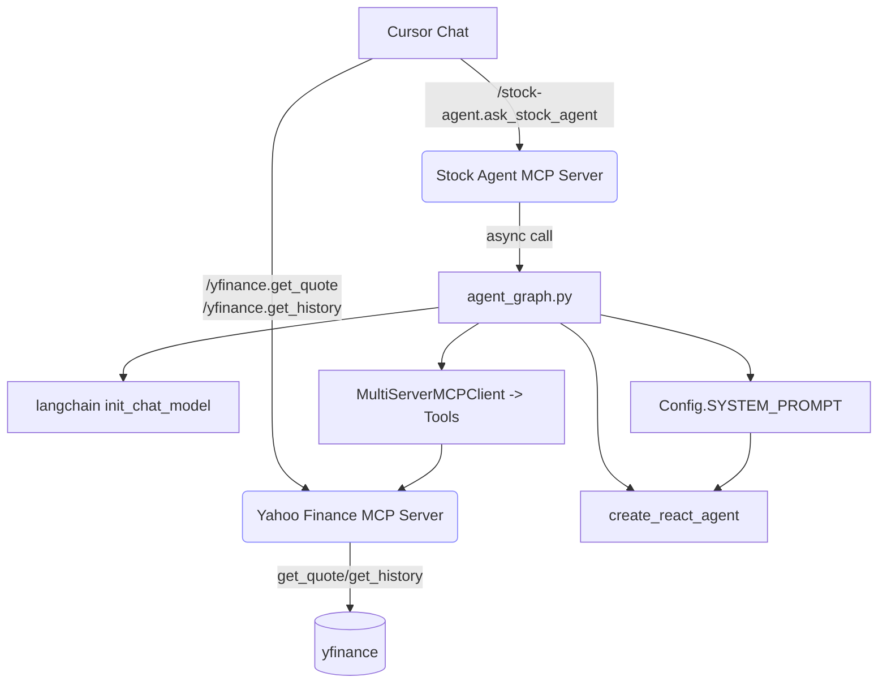

# 주식 시세 조회 AI Agent (MCP)

Yahoo Finance를 통해 주식 시세 정보를 조회하는 AI 에이전트입니다. Cursor MCP를 통해 사용할 수 있습니다.

- 기본 브랜치: main

## 기능

- 실시간 주식 가격 조회
- 주식 히스토리 데이터 조회 (OHLCV)
- 자연어 질의 응답
- 시스템 프롬프트(역할) 사전 주입
- Cursor MCP 통합

## 빠른 시작

### 0) 가상환경(venv)
```bash
cd ~/develop/study/LangChain
python3 -m venv .venv
source .venv/bin/activate
python -m pip install --upgrade pip
```

### 1) 의존성 설치
```bash
pip install -r mcp-yfinance-agent/mcp-yfinance-agent/requirements.txt
```

### 2) 환경변수 설정
```bash
cp mcp-yfinance-agent/mcp-yfinance-agent/env.example mcp-yfinance-agent/mcp-yfinance-agent/.env
```
`.env`의 주요 항목:
```env
# LLM 설정 (무료 사용 시 권장: Ollama)
LLM_ID=cursor:auto   # Cursor 채팅에서는 가능하나, LangChain 내 직접 사용은 비권장
# OPENAI_API_KEY=your_openai_api_key_here

# 시스템 프롬프트(역할/가이드라인)
SYSTEM_PROMPT="당신은 보수적 리스크 관리를 따르는 주식 분석 에이전트입니다..."
```

### 3) Cursor MCP 등록
`~/.cursor/mcp.json`에 venv 파이썬으로 등록(경로는 환경에 맞게 조정):
```json
{
  "mcpServers": {
    "yfinance": {
      "command": "/Users/ihncheolhwan/develop/study/LangChain/.venv/bin/python",
      "args": [
        "/Users/ihncheolhwan/develop/study/LangChain/mcp-yfinance-agent/mcp-yfinance-agent/src/mcp_yfinance_server.py"
      ],
      "transport": "stdio"
    },
    "stock-agent": {
      "command": "/Users/ihncheolhwan/develop/study/LangChain/.venv/bin/python",
      "args": [
        "/Users/ihncheolhwan/develop/study/LangChain/mcp-yfinance-agent/mcp-yfinance-agent/src/cursor_mcp_server.py"
      ],
      "transport": "stdio"
    }
  }
}
```
Cursor를 Reload Window 후 사용하세요.

## 사용법

### 1) Cursor에서 직접 사용
- 에이전트 정보: `/stock-agent.get_agent_info`
- 시세 질의: `/stock-agent.ask_stock_agent "AAPL 최신 가격과 최근 5일 요약해서 보여줘"`
- 로우 데이터 도구:
  - `/yfinance.get_quote ticker=AAPL`
  - `/yfinance.get_history ticker=AAPL period=5d interval=1d`

### 2) 로컬 에이전트 스모크 테스트
```bash
python mcp-yfinance-agent/mcp-yfinance-agent/src/agent_graph.py
```

## 시스템 프롬프트(역할) 설정
- `.env`의 `SYSTEM_PROMPT`로 제어하며, 모든 호출에 system 메시지로 자동 주입됩니다.
- 예시:
```env
SYSTEM_PROMPT="너는 보수적 리스크 관리 원칙을 따르는 주식 분석 에이전트다..."
```

## LLM 설정 옵션

### 1) Cursor Auto
- Cursor 채팅에선 사용 가능하나, LangChain `init_chat_model("cursor:auto")`는 직접 지원되지 않을 수 있습니다.
- 에이전트 스크립트 실행 시 이슈가 있으면 아래 옵션을 권장합니다.

### 2) Ollama (무료, 권장 대안)
- 로컬 모델을 설치하여 무료 사용 가능
- 예시:
```env
LLM_ID=ollama:llama3.2
```

### 3) OpenAI (유료)
```env
LLM_ID=openai:gpt-4o-mini
OPENAI_API_KEY=your_openai_api_key_here
```

## 트러블슈팅
- MCP 명령 자동완성이 안 보이면: Cursor에서 "MCP: Reload Servers" 실행 또는 Reload Window
- `cursor:auto`로 에이전트 스크립트가 실패하면: `LLM_ID`를 `ollama:...` 또는 `openai:...`로 변경
- 파이썬 경로 오류: `~/.cursor/mcp.json`의 `command`가 venv 파이썬을 가리키는지 확인

## 프로젝트 구조 (Mermaid)


## 구현 내용 상세
- `src/mcp_yfinance_server.py`
  - MCP 도구 2개 제공: `get_quote`, `get_history`
  - `yfinance` 호출 시 재시도 래퍼(`safe_yf_call`)로 안정성 개선
  - `Quote`, `Bar` Pydantic 모델로 스키마 명확화
- `src/agent_graph.py`
  - `MultiServerMCPClient`로 yfinance MCP를 stdio로 연결해 툴 획득
  - `init_chat_model(LLM_ID)`로 LLM 초기화, `create_react_agent`로 ReAct 에이전트 구성
  - `SYSTEM_PROMPT`를 system 메시지로 선 주입하여 일관된 역할/톤 유지
  - 사용자 질의를 받아 MCP 툴을 활용해 응답 생성 후 최종 답변을 반환
- `src/cursor_mcp_server.py`
  - Cursor에서 호출 가능한 MCP 도구 2개: `ask_stock_agent`, `get_agent_info`
  - 내부적으로 `agent_graph.main`을 호출해 자연어 질의 처리
- `src/config.py`
  - `.env` 로딩 및 설정 중앙화: `LLM_ID`, 재시도, verbose, `SYSTEM_PROMPT` 등
  - OpenAI 사용 시에만 API 키 필수 검증
- `env.example`
  - `SYSTEM_PROMPT`를 포함한 템플릿 제공
- `requirements.txt`
  - LangChain, LangGraph, fastmcp, yfinance 등 의존성 명시
- `~/.cursor/mcp.json`
  - `yfinance`, `stock-agent` MCP 서버를 venv 파이썬으로 등록해 Cursor에서 바로 사용 가능

## Git
- 기본 브랜치: `main`
- 원격: `origin` → `https://github.com/ch200203/Devocean-OpenLab-MCP.git`
- 브랜치 전략 예시:
```bash
git checkout -b feature/your-change
# ... commit ...
git push -u origin feature/your-change
``` 