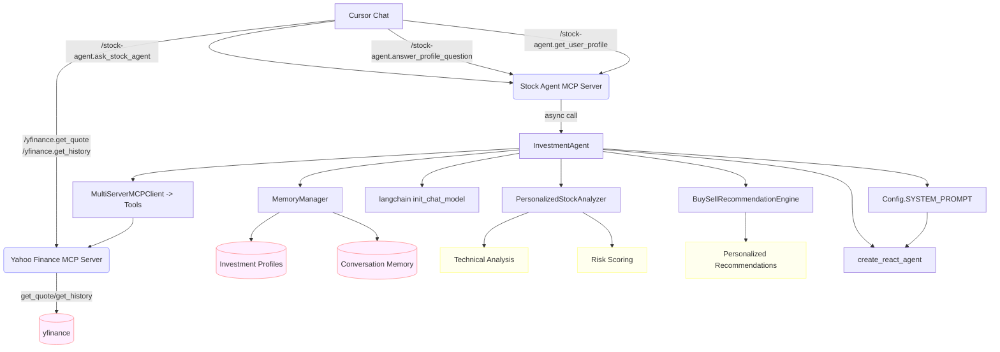

# 투자 성향 기반 주식 분석 AI Agent (MCP)

투자 성향을 파악하고 맞춤형 주식 분석 및 매수/매도 추천을 제공하는 AI 에이전트입니다. Cursor MCP를 통해 사용할 수 있습니다.

- 기본 브랜치: main

## 🚀 주요 기능

### 투자 성향 관리
- **대화형 투자 성향 설문**: 리스크 성향, 투자 기간, 거래 스타일, 선호 섹터 수집
- **개인화된 프로필 저장**: 사용자별 투자 성향 메모리 관리
- **동적 프로필 업데이트**: 투자 성향 변경 시 실시간 반영

### 맞춤형 종목 분석
- **투자 성향 기반 분석**: 보수적/중간/공격적 성향에 따른 차별화된 분석
- **기술적 지표 분석**: SMA, RSI, 볼린저 밴드, 거래량 분석
- **종합 점수 시스템**: 리스크, 변동성, 모멘텀, 추세, 거래량 점수 종합

### 매수/매도 추천
- **개인화된 추천**: 투자 성향에 따른 맞춤형 매수/매도 라인
- **리스크 관리**: 개인별 손절/익절 가이드라인 제공
- **신뢰도 점수**: 추천의 신뢰도를 백분율로 표시

### 포트폴리오 추적 및 관리
- **보유 종목 관리**: 평단가, 수량, 섹터별 포지션 추적
- **실시간 수익률 계산**: 미실현 손익 및 수익률 자동 계산
- **포트폴리오 분석**: 집중도, 리스크 메트릭, 성과 분석
- **포지션별 추천**: 보유 종목에 대한 개별 매수/매도 추천

### 기존 기능
- 실시간 주식 가격 조회
- 주식 히스토리 데이터 조회 (OHLCV)
- 자연어 질의 응답
- Cursor MCP 통합

## 빠른 시작

### 0) 가상환경(venv)
```bash
cd ~/develop/study/LangChain
python3 -m venv .venv
source .venv/bin/activate
python -m pip install --upgrade pip
```

### 1) 의존성 설치
```bash
pip install -r mcp-yfinance-agent/mcp-yfinance-agent/requirements.txt
```

### 2) 환경변수 설정
```bash
cp mcp-yfinance-agent/mcp-yfinance-agent/env.example mcp-yfinance-agent/mcp-yfinance-agent/.env
```
`.env`의 주요 항목:
```env
# LLM 설정 (무료 사용 시 권장: Ollama)
LLM_ID=cursor:auto   # Cursor 채팅에서는 가능하나, LangChain 내 직접 사용은 비권장
# OPENAI_API_KEY=your_openai_api_key_here

# 시스템 프롬프트(역할/가이드라인)
SYSTEM_PROMPT="당신은 보수적 리스크 관리를 따르는 주식 분석 에이전트입니다..."
```

### 3) Cursor MCP 등록
`~/.cursor/mcp.json`에 venv 파이썬으로 등록(경로는 환경에 맞게 조정):
```json
{
  "mcpServers": {
    "yfinance": {
      "command": "/Users/ihncheolhwan/develop/study/LangChain/.venv/bin/python",
      "args": [
        "/Users/ihncheolhwan/develop/study/LangChain/mcp-yfinance-agent/mcp-yfinance-agent/src/mcp_yfinance_server.py"
      ],
      "transport": "stdio"
    },
    "stock-agent": {
      "command": "/Users/ihncheolhwan/develop/study/LangChain/.venv/bin/python",
      "args": [
        "/Users/ihncheolhwan/develop/study/LangChain/mcp-yfinance-agent/mcp-yfinance-agent/src/cursor_mcp_server.py"
      ],
      "transport": "stdio"
    }
  }
}
```
Cursor를 Reload Window 후 사용하세요.

## 사용법

### 1) Cursor에서 직접 사용

#### 투자 성향 기반 분석
- **첫 사용 시**: `/stock-agent.ask_stock_agent "AAPL 분석해줘" user_id=my_user_id`
  - 자동으로 투자 성향 설문이 시작됩니다
- **투자 성향 답변**: `/stock-agent.answer_profile_question user_id=my_user_id step=risk_tolerance answer=conservative`
- **프로필 조회**: `/stock-agent.get_user_profile user_id=my_user_id`
- **맞춤형 분석**: `/stock-agent.ask_stock_agent "TSLA 매수 추천해줘" user_id=my_user_id`

#### 포트폴리오 관리
- **포지션 추가**: `/stock-agent.add_position user_id=my_user ticker=AAPL quantity=10 average_price=150.0 sector=technology`
- **포지션 제거**: `/stock-agent.remove_position user_id=my_user ticker=AAPL`
- **포트폴리오 요약**: `/stock-agent.get_portfolio_summary user_id=my_user`
- **포지션 목록**: `/stock-agent.get_positions_list user_id=my_user`
- **포트폴리오 분석**: `/stock-agent.analyze_portfolio user_id=my_user`
- **포지션 추천**: `/stock-agent.get_position_recommendation user_id=my_user ticker=AAPL`

#### 기존 기능
- 에이전트 정보: `/stock-agent.get_agent_info`
- 일반 시세 질의: `/stock-agent.ask_stock_agent "AAPL 최신 가격과 최근 5일 요약해서 보여줘"`
- 로우 데이터 도구:
  - `/yfinance.get_quote ticker=AAPL`
  - `/yfinance.get_history ticker=AAPL period=5d interval=1d`

### 2) 로컬 테스트
```bash
# 기본 에이전트 테스트
python mcp-yfinance-agent/mcp-yfinance-agent/src/agent_graph.py

# 대화형 플로우 테스트
python mcp-yfinance-agent/mcp-yfinance-agent/src/test_interactive_flow.py

# 포트폴리오 데모
python mcp-yfinance-agent/mcp-yfinance-agent/src/portfolio_demo.py
```

### 3) 투자 성향 설문 예시
```
1. 리스크 성향: conservative (보수적) / moderate (중간) / aggressive (공격적)
2. 투자 기간: short_term (단기) / medium_term (중기) / long_term (장기)
3. 거래 스타일: day_trading (당일) / swing_trading (스윙) / position_trading (포지션) / value_investing (가치)
4. 선호 섹터: technology, healthcare, finance 등 (복수 선택 가능)
```

## 시스템 프롬프트(역할) 설정
- `.env`의 `SYSTEM_PROMPT`로 제어하며, 모든 호출에 system 메시지로 자동 주입됩니다.
- 예시:
```env
SYSTEM_PROMPT="너는 보수적 리스크 관리 원칙을 따르는 주식 분석 에이전트다..."
```

## LLM 설정 옵션

### 1) Cursor Auto
- Cursor 채팅에선 사용 가능하나, LangChain `init_chat_model("cursor:auto")`는 직접 지원되지 않을 수 있습니다.
- 에이전트 스크립트 실행 시 이슈가 있으면 아래 옵션을 권장합니다.

### 2) Ollama (무료, 권장 대안)
- 로컬 모델을 설치하여 무료 사용 가능
- 예시:
```env
LLM_ID=ollama:llama3.2
```

### 3) OpenAI (유료)
```env
LLM_ID=openai:gpt-4o-mini
OPENAI_API_KEY=your_openai_api_key_here
```

## 트러블슈팅
- MCP 명령 자동완성이 안 보이면: Cursor에서 "MCP: Reload Servers" 실행 또는 Reload Window
- `cursor:auto`로 에이전트 스크립트가 실패하면: `LLM_ID`를 `ollama:...` 또는 `openai:...`로 변경
- 파이썬 경로 오류: `~/.cursor/mcp.json`의 `command`가 venv 파이썬을 가리키는지 확인

## 프로젝트 구조 (Mermaid)


## 구현 내용 상세

### 핵심 컴포넌트
- **`src/investment_profile.py`**: 투자 성향 프로필 데이터 모델 및 관리
  - `InvestmentProfile`: 사용자 투자 성향 정보 저장
  - `InvestmentProfileManager`: 프로필 CRUD 작업
  - `InvestmentProfileBuilder`: 단계별 프로필 생성
  - `INVESTMENT_QUESTIONNAIRE`: 설문 질문 템플릿

- **`src/memory_manager.py`**: 대화 메모리 및 투자 성향 수집 관리
  - `ConversationMemory`: 사용자별 대화 기록 저장
  - `InvestmentProfileCollector`: 대화형 투자 성향 수집
  - `MemoryManager`: 전역 메모리 관리

- **`src/personalized_analyzer.py`**: 맞춤형 종목 분석 엔진
  - `PersonalizedStockAnalyzer`: 투자 성향 기반 종목 분석
  - `BuySellRecommendationEngine`: 매수/매도 추천 엔진
  - `TechnicalIndicators`: 기술적 지표 계산
  - `StockAnalysis`: 종목 분석 결과 모델

### 기존 컴포넌트 (개선됨)
- **`src/agent_graph.py`**: 메인 에이전트 로직 (대폭 개선)
  - `InvestmentAgent`: 투자 성향 기반 AI 에이전트
  - 투자 성향 수집 → 맞춤형 분석 → 추천 플로우
  - 종목 코드 자동 추출 및 분석

- **`src/cursor_mcp_server.py`**: MCP 서버 (기능 확장)
  - `ask_stock_agent`: 투자 성향 기반 분석 (user_id 지원)
  - `answer_profile_question`: 투자 성향 설문 답변 처리
  - `get_user_profile`: 사용자 프로필 조회
  - `start_profile_collection`: 투자 성향 수집 시작

- **`src/mcp_yfinance_server.py`**: Yahoo Finance MCP 서버 (기존 유지)
  - `get_quote`, `get_history` 도구 제공
  - 안정성 개선된 yfinance 래퍼

### 설정 및 테스트
- **`src/config.py`**: 환경 설정 (기존 유지)
- **`src/test_interactive_flow.py`**: 대화형 플로우 테스트 스크립트
- **`requirements.txt`**: pandas, numpy 의존성 추가
- **`~/.cursor/mcp.json`**: MCP 서버 등록 (기존 유지)

## Git
- 기본 브랜치: `main`
- 원격: `origin` → `https://github.com/ch200203/Devocean-OpenLab-MCP.git`
- 브랜치 전략 예시:
```bash
git checkout -b feature/your-change
# ... commit ...
git push -u origin feature/your-change
``` 